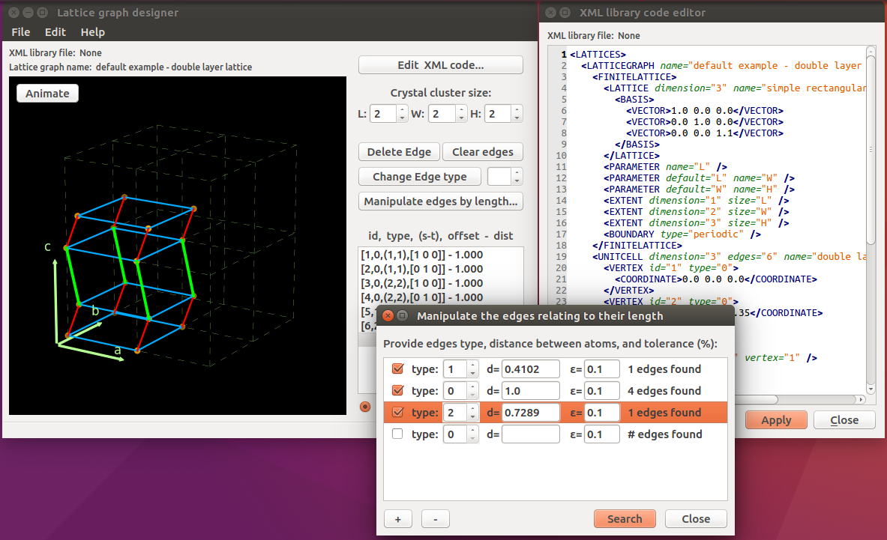

Lattice graph designer 1.0a1
**************************************

- Git-hub repo: https://github.com/luchko/latticegraph_designer
- Documentation: [Links to the project's ReadTheDocs page]
- Free software: MIT license

Build status
============

[A TravisCI button showing the state of the build]

[pyup.io button to deal with requirements]

Overview
========

Lattice graph designer is a tool which allows to visualize and create a lattice graph model using the intuitive GUI and interactive 3D drag-and-drop graph manipulation pane. It was primarily created for the `ALPS project <http://alps.comp-phys.org/>`_ to deal with a lattice graph of Heisenberg model defined in `ALPS xml graph format <http://alps.comp-phys.org/mediawiki/index.php/Tutorials:LatticeHOWTO>`_. Support of the other formats and projects can be extended.

GUI is based on PyQt. Program is compatible with Python 2.7 or Python 3.3+ and PyQt4 4.6+ or PyQt5 5.2+.

-------------------------

-------------------------

Main features:
==============

- import and visualisation of the lattice graph saved in the ALPS lattice graph xml format.
- import crystal structure providing unit cell parameters, sites coordinates and space group symmetry operations.
- import crystal structure from the CIF file.
- export lattice graph to the ALPS compatible xml file.
- interactive 3D drag-and-drop graph manipulation pane based on matplotlib
- manipulation edges (add, remove, change type) referring to the distance between vertices they connect.
- xml code editor (highlighting, synchronization with manipulation pane)
- exporting figure of the lattice graph model.
- animation manager allows to animate 3D model and save the animation in mp4 or gif format.
- preferences manager allows setting the visual theme of the lattice graph displayed on the manipulation pane.

Quickstart
==========

Installation (cross-platform way from source)
---------------------------------------------

1. Download a source of the last stable package version [LINK]
2. Open the terminal.
3. Move to the package root directory.
4. In your command prompt type:

    ``python setup.py install``

5. Further, in order to launch the program type:

    ``graphdesigner [pathToYourLatticeGraphFile.xml]``

   **note:** If *pathToYourLatticeGraphFile.xml* is not provided program will load a default example. You can open a lattice graph file later.

6. Optionally you can lock your tool's link on the launcher for quick access.

7. Check a quick functionality demo video on YouTube. [LINK SHOULD BE HERE]

Running from source
-------------------

The fastest way to run LatticeGraph designer is to get the source code using git, install Python and PyQt, and run these commands:

1. Install dependencies.
2. python bootstrap.py

You may want to do this for fixing bugs, adding new features, learning how the tool works or just getting a taste of it.

Contacts:
=========

About feature extension or bugs report you can create issue or feature request at [LINK] or feel free to contact me directly by e-mail:

	**Ivan Luchko** - luchko.ivan@gmail.com
